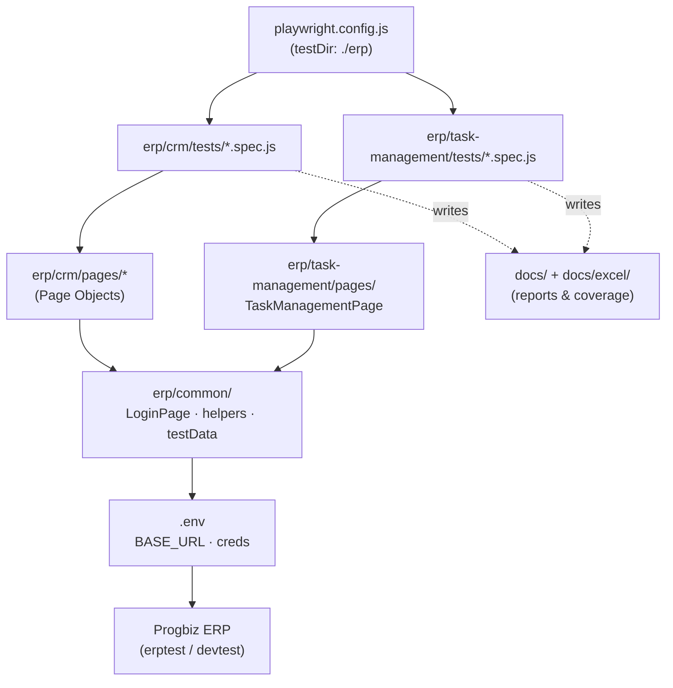
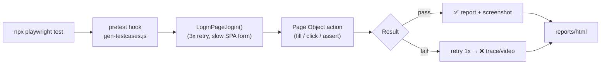

# Progbiz ERP — Playwright Automation Suite

End‑to‑end UI automation for the **Progbiz ERP** — organised by module (**CRM** and **Task Management**) using the Page Object Model.

- **Repo:** https://github.com/vismayatk/Progbiz-erp-testers · **Branch:** `master`
- **Framework:** [Playwright](https://playwright.dev/) (`@playwright/test`) · Node.js · Page Object Model
- **Targets (switch via `.env`):** `erptest.progbiz.in` (company `lesol_test`) · `devtest.progbiz.in` (company `Lesol_dev`)
- **Scale:** **103 tests** across **11 spec files** in **2 modules**

---

## 📁 Folder structure

```
erp-tests/
├─ README.md                     ← you are here
├─ playwright.config.js          ← testDir: ./erp · testMatch: **/tests/**/*.spec.js
├─ package.json                  ← npm scripts (test / test:crm / test:task / docs …)
├─ .env  (git-ignored)           ← BASE_URL · COMPANY_CODE · CRM_USERNAME · PASSWORD · SECOND_*
│
├─ erp/                          ← ✦ AUTOMATION CODE
│   ├─ common/                   ← shared across both modules
│   │   ├─ LoginPage.js
│   │   ├─ helpers.js
│   │   ├─ testData.js
│   │   └─ sample-document.txt
│   ├─ crm/
│   │   ├─ pages/                ← 8 CRM page objects (Enquiry, FollowUp, Quotation, Item, …)
│   │   └─ tests/                ← 7 CRM specs (login, homepage, item, enquiry, followup, quotation, flow)
│   └─ task-management/
│       ├─ pages/                ← TaskManagementPage.js
│       └─ tests/                ← 4 TM specs (base, modal, details, multiuser)
│
├─ docs/                         ← ✦ DOCUMENTATION
│   ├─ TEST_CASES.md             ← auto-generated index of every test id + run command
│   ├─ CRM_TESTCASE_COVERAGE.md
│   ├─ TASK_MANAGEMENT_COVERAGE.md
│   ├─ CRM_MODULE_DOCUMENTATION.md · CRM_DASHBOARD_TEST_CASES.md · TEST_SCENARIOS.md · RUN_COMMANDS.md
│   └─ excel/                    ← ✦ EXCEL DELIVERABLES
│       ├─ CRM_Automation_Scenarios.xlsx
│       ├─ TaskManagement_Automation_Scenarios.xlsx
│       ├─ CRM- Test Case - Automation Status.xlsx
│       └─ CRM_Test_Cases.xlsx
│
├─ scripts/                      ← generators + discovery/QA tools
│   ├─ gen-testcases.js          ← builds docs/TEST_CASES.md (runs on `pretest`)
│   ├─ gen_scenarios_xlsx.py · gen_crm_status_xlsx.py
│   └─ legacy/                   ← archived one-off exploration scripts
│
└─ reports/ · screenshots/ · test-results/   ← run artifacts (git-ignored)
```

---

## 🧭 Suite architecture



## 🔄 Test-run flow



---

## 🧩 Modules & coverage

### CRM — `erp/crm/` (7 specs)
| Area | Spec | Scenarios |
|---|---|---|
| Login | `crm_login.spec.js` | Login_01–08 |
| Homepage | `crm_homepage.spec.js` | Home_01–26 |
| Item | `crm_item.spec.js` | Item_01–15 |
| Enquiry | `crm_enquiry.spec.js` | ENQ‑01–28 |
| Followup | `crm_followup.spec.js` | ENQ‑29–42 · QT‑019–028 |
| Quotation | `crm_quotation.spec.js` | QT‑001–018 |
| CRM Flow (E2E) | `enquiry_flow.spec.js` | TC‑01–16 |

### Task Management — `erp/task-management/` (4 specs)
| Area | Spec | Scenarios |
|---|---|---|
| Base (My Tasks, create, pages, report) | `task_management.spec.js` | TM‑01–08 |
| Create New → Task modal | `task_management_modal.spec.js` | TM‑09–23 |
| Task Details (notes, docs, edit, reschedule, add‑lead, lifecycle) | `task_management_details.spec.js` | TM‑24–28 |
| Multi‑user visibility | `task_management_multiuser.spec.js` | MU‑01–03 |

> Full scenario → step → status mapping: **`docs/excel/CRM_Automation_Scenarios.xlsx`** and **`docs/excel/TaskManagement_Automation_Scenarios.xlsx`**.

---

## ⚙️ Setup

```bash
npm install
npx playwright install chromium
```

Create `.env` at the repo root (copy from `.env.example`):
```
BASE_URL=https://erptest.progbiz.in
COMPANY_CODE=lesol_test
CRM_USERNAME=admin
PASSWORD=123
# optional 2nd user for multi-user tests (MU-01..03)
SECOND_USERNAME=
SECOND_PASSWORD=
SECOND_NAME=
```

## ▶️ Running

```bash
npx playwright test                 # everything (103 tests)
npm run test:crm                    # all CRM        (npx playwright test erp/crm)
npm run test:task                   # all Task Mgmt  (npx playwright test erp/task-management)

npx playwright test erp/crm/tests/crm_login.spec.js   # one file
npx playwright test -g "TM-28 \|"                      # one case by id

npm run report                      # open the HTML report (reports/html)
npm run docs                        # regenerate docs/TEST_CASES.md
$env:HEADED=1; npx playwright test  # (PowerShell) run with a visible browser
```

> Run from the repo root. Use a **substring** filter (`erp/crm`, `task_management`), never a `*.spec.js` glob (PowerShell leaves `*` literal → "No tests found").

---

## 📝 Notes
- **Slow SPA login** (both tenants) — `LoginPage.login()` retries the whole flow 3× with long waits.
- **Backend instability** — occasional "Oops / Error Code" on saves; tests retry once (`retries: 1`).
- Some Excel cases are **N/A on this build** (no Price field, no `/items` Delete, no Remember‑Password checkbox) — marked *Skip* with reasons in the coverage docs.
- Docs regenerate automatically before every `npm test` via the `pretest` hook.
