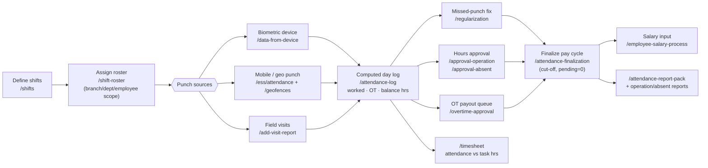
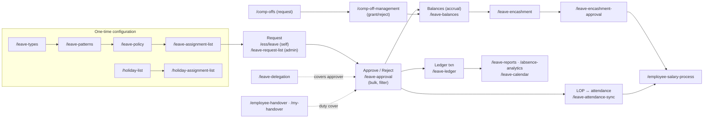
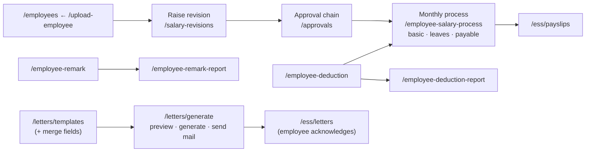
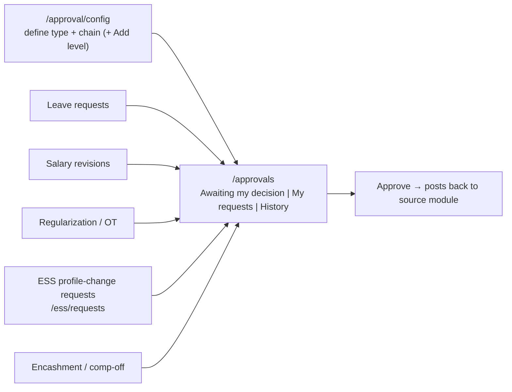

# HRMS Module — Overview, Structure & Flowcharts

> **App:** https://hrms-erp.progbiz.in · **Tenant:** company code `Hrms` · test user `vismaya`
> **Prepared for:** Playwright automation code preparation (module study phase)
> **Source of truth:** live crawl of all 80 HRMS pages on 2026-07-20 — raw captures in [`hrms/data/pages/`](../data/pages), screenshots in [`hrms/screenshots/`](../screenshots)

---

## 1. What the HRMS module is

The HRMS module of the ProgBiz ERP covers the **entire employee lifecycle**: hiring (Recruitment), joining (Onboarding), the employee master and payroll inputs (Core HR), day-to-day time tracking (Attendance), absence handling (Leave Management), and an employee-facing portal (My Workspace / ESS). A generic **approval-workflow engine** (`/approvals` + `/approval/config`) threads through all of it — leave requests, salary revisions, regularizations, profile-change requests and encashments all land in the same approval inbox.

The login form uses the same 3-field pattern as the other ERP builds: `#companycode`, `#signin-username`, `#signin-password`. After login the user lands on `/home`.

## 2. Sub-module map (menu tree)

```
HRMS
├── Core HR
│   ├── Employee ......................... /employees
│   ├── Section .......................... /sections
│   ├── Worker Directory ................. /worker-directory        (Cards | Org Chart)
│   ├── Salary Revisions ................. /salary-revisions
│   ├── Employee Salary Process .......... /employee-salary-process
│   ├── Employee Deductions .............. /employee-deduction
│   ├── Employee Remarks ................. /employee-remark
│   ├── Probation Dashboard .............. /hrms/probation
│   ├── Probation Templates .............. /hrms/probation-templates
│   ├── Probation Report ................. /hrms/probation-report
│   ├── Resigned Employees ............... /resigned-employees
│   ├── Employee Excel Import ............ /upload-employee
│   ├── Letters
│   │   ├── Letter Templates ............. /letters/templates       (+ /letters/fields)
│   │   └── Generate Letter .............. /letters/generate
│   ├── Approvals
│   │   ├── My Approvals ................. /approvals               (workflow inbox)
│   │   └── Approval Config .............. /approval/config         (chain builder)
│   └── Reports
│       ├── Deduction Report ............. /employee-deduction-report
│       └── Remark Report ................ /employee-remark-report
├── Recruitment
│   ├── Job Requisitions ................. /requisition-list
│   ├── Job Board ........................ /vacancy-list            (Job Openings | Candidates | Talent Pools)
│   ├── Current Openings ................. /current-openings        (public "Join Our Team" careers page)
│   ├── Job Applications ................. /job-applications-list
│   ├── Candidates ....................... /candidates              (New | In Progress | Shortlisted | Selected | Rejected)
│   ├── Assessments ...................... /assessment-list
│   ├── Interview Schedules .............. /interview-schedules
│   ├── Offers ........................... /offer-list
│   ├── Pipeline ▸ Pipeline Board ........ /recruitment-pipeline    (Kanban, Configure Stages, Score)
│   ├── Communication Templates .......... /communication-templates
│   ├── Talent Pool ...................... /talent-pool
│   ├── Settings
│   │   ├── Candidate Status ............. /candidate-status
│   │   └── Interview Rounds ............. /interview-rounds
│   └── Onboarding
│       ├── Onboarding Templates ......... /onboarding-templates
│       └── Onboarding Pipeline .......... /onboarding-pipeline
├── Attendance
│   ├── Shifts & Rules ................... /shifts
│   ├── Shift Roster ..................... /shift-roster
│   ├── Attendance Log ................... /attendance-log
│   ├── Data from Device ................. /data-from-device        (biometric punches)
│   ├── Add Visit Report ................. /add-visit-report        (field-visit punches)
│   ├── Regularization ................... /regularization
│   ├── Overtime Approval ................ /overtime-approval
│   ├── Attendance Finalization .......... /attendance-finalization (pay-cycle runs)
│   ├── Geofences ........................ /geofences
│   ├── Timesheet ........................ /timesheet               (attendance hrs vs task hrs)
│   ├── Attendance Report Pack ........... /attendance-report-pack
│   └── Approvals
│       ├── Approval Operation ........... /approval-operation      (worked/late/OT hour approval)
│       ├── Approval Operation Report .... /approval-operation-report
│       ├── Approval Absent .............. /approval-absent
│       └── Approval Absent Report ....... /approval-absent-report
├── Leave Management
│   ├── Leave Types ...................... /leave-types
│   ├── Leave Patterns ................... /leave-patterns
│   ├── Leave Policy ..................... /leave-policy
│   ├── Leave Assignment ................. /leave-assignment-list
│   ├── Leave Request .................... /leave-request-list
│   ├── Leave Approval ................... /leave-approval
│   ├── My Leave Policy .................. /my-leave-policy
│   ├── Leave Balances ................... /leave-balances          (Run Accrual)
│   ├── Leave Ledger ..................... /leave-ledger
│   ├── Attendance Sync .................. /leave-attendance-sync   (LOP recalculation)
│   ├── Leave Encashment ................. /leave-encashment
│   ├── Encashment Approval .............. /leave-encashment-approval
│   ├── Leave Delegation ................. /leave-delegation
│   ├── Employee Handover ................ /employee-handover
│   ├── Comp-Offs ........................ /comp-offs
│   ├── Comp-Off Management .............. /comp-off-management
│   ├── Holidays ......................... /holiday-list            (Calendar | Export)
│   ├── Holiday Assignment ............... /holiday-assignment-list
│   └── Leave Analytics
│       ├── Leave Reports ................ /leave-reports           (Register | Balance | Utilization)
│       ├── Absence Analytics ............ /absence-analytics       (Bradford Factor)
│       └── Leave Calendar ............... /leave-calendar
└── My Workspace (Employee Self-Service)
    ├── My Workspace ..................... /ess                     (self-service dashboard)
    ├── My Profile ....................... /ess/profile
    ├── My Requests ...................... /ess/requests            (profile change requests)
    ├── My Leave ......................... /ess/leave               (balances + apply)
    ├── My Handover ...................... /my-handover
    ├── My Attendance .................... /ess/attendance          (Regularize | Raise OT)
    ├── My Locations ..................... /ess/locations           (geo work locations, map)
    ├── My Documents ..................... /ess/documents
    ├── My Letters ....................... /ess/letters
    ├── My Pay ........................... /ess/payslips
    └── My Probation ..................... /ess/probation
```

Related org masters (under the separate **Master** menu, referenced by HRMS forms): `department`, `designations`, `teams`, `business-contacts`.

## 3. HRMS module map (flowchart)

```mermaid
flowchart TB
    LOGIN["/login<br/>company · username · password"] --> HOME["/home"]
    HOME --> HRMS{{"HRMS menu"}}

    HRMS --> COREHR
    HRMS --> REC
    HRMS --> ATT
    HRMS --> LVE
    HRMS --> ESS

    subgraph REC["Recruitment & Onboarding"]
        direction TB
        R1["/requisition-list"] --> R2["/vacancy-list"] --> R3["/current-openings<br/>(public careers)"]
        R3 --> R4["/job-applications-list"] --> R5["/candidates"]
        R5 --> R6["/assessment-list"] & R7["/interview-schedules"] & RP["/recruitment-pipeline<br/>(kanban)"]
        R7 --> R8["/offer-list"]
        R8 --> RO["/onboarding-pipeline<br/>+ /onboarding-templates"]
        R5 -. rejected/archived .-> RT["/talent-pool"]
        RS["settings:<br/>/candidate-status · /interview-rounds<br/>/communication-templates"] -.-> R5
    end

    subgraph COREHR["Core HR"]
        direction TB
        C1["/employees"] --> C2["/worker-directory<br/>(cards · org chart)"]
        CU["/upload-employee<br/>(excel import)"] --> C1
        C1 --> CP["/hrms/probation<br/>+ templates + report"]
        C1 --> CS["/salary-revisions"] --> CSP["/employee-salary-process"]
        C1 --> CD["/employee-deduction"] --> CDR["/employee-deduction-report"]
        C1 --> CR["/employee-remark"] --> CRR["/employee-remark-report"]
        CL["/letters/templates"] --> CLG["/letters/generate"]
        C1 --> CX["/resigned-employees"]
        C3["/sections"] -.-> C1
    end

    subgraph ATT["Attendance & Time"]
        direction TB
        A1["/shifts"] --> A2["/shift-roster"]
        A2 --> A3["/attendance-log"]
        AD["/data-from-device<br/>(biometric)"] --> A3
        AV["/add-visit-report"] --> A3
        AG["/geofences"] -.-> A3
        A3 --> A4["/regularization"] & A5["/overtime-approval"] & AO["/approval-operation<br/>/approval-absent"]
        A3 --> A6["/timesheet"]
        A4 & A5 & AO --> A7["/attendance-finalization<br/>(pay-cycle run)"]
        A7 --> ARP["/attendance-report-pack<br/>+ approval reports"]
    end

    subgraph LVE["Leave Management"]
        direction TB
        L1["/leave-types"] --> L2["/leave-patterns"] --> L3["/leave-policy"] --> L4["/leave-assignment-list"]
        LH["/holiday-list"] --> LHA["/holiday-assignment-list"]
        L4 --> L5["/leave-request-list"] --> L6["/leave-approval"]
        L6 --> L7["/leave-ledger"] & L8["/leave-balances"]
        L6 --> L9["/leave-attendance-sync<br/>(LOP)"]
        LC["/comp-offs"] --> LCM["/comp-off-management"] --> L8
        L8 --> LE["/leave-encashment"] --> LEA["/leave-encashment-approval"]
        LD["/leave-delegation"] -.-> L6
        LEH["/employee-handover"] -.-> L6
        L7 --> LR["/leave-reports · /absence-analytics · /leave-calendar"]
    end

    subgraph ESS["My Workspace (ESS)"]
        direction TB
        E0["/ess dashboard"] --> E1["/ess/leave"] & E2["/ess/attendance"] & E3["/ess/profile · /ess/requests"] & E4["/ess/documents · /ess/letters"] & E5["/ess/payslips"] & E6["/ess/locations"] & E7["/ess/probation · /my-handover"]
    end

    WF["Workflow engine<br/>/approval/config → /approvals"]
    REC -.approvals.-> WF
    COREHR -.approvals.-> WF
    ATT -.approvals.-> WF
    LVE -.approvals.-> WF
    ESS -.requests.-> WF

    RO ==> C1
    A7 ==> CSP
    L9 ==> A3
    L6 ==> CSP
    E1 ==> L5
    E2 ==> A4 & A5
    E6 ==> AG
    E5 ==> CSP
    CLG ==> E4
    CP ==> E7
```



## 4. End-to-end process flows

### 4.1 Hire-to-Employee (Recruitment → Onboarding → Core HR)

```mermaid
flowchart LR
    A["New Requisition<br/>/requisition-list"] --> B["Job Opening<br/>/vacancy-list"]
    B --> C["Public posting<br/>/current-openings"]
    C --> D["Application received<br/>/job-applications-list"]
    D --> E["Candidate record<br/>/candidates<br/>New → In Progress → Shortlisted"]
    E --> F["Assessment<br/>/assessment-list"]
    F --> G["Interviews (rounds)<br/>/interview-schedules"]
    G --> H{"Decision on<br/>/recruitment-pipeline"}
    H -- Selected --> I["Offer (CTC, joining)<br/>/offer-list"]
    H -- Rejected --> J["Archive w/ tags & score<br/>/talent-pool"]
    I --> K["Start Onboarding<br/>/onboarding-pipeline<br/>(checklist from template)"]
    K --> L["New Employee<br/>/employees"]
    L --> M["Start Probation<br/>/hrms/probation"]
    M -- confirmed --> N["Regular employee"]
    M -- outcome tracked --> O["/hrms/probation-report"]
```



Supporting config: `/candidate-status` (follow-up stages), `/interview-rounds` (round order), `/communication-templates` (candidate emails), `/onboarding-templates` (joining checklist).

### 4.2 Daily attendance cycle



### 4.3 Leave lifecycle



### 4.4 Salary & document admin (Core HR)



### 4.5 Approval workflow engine (cross-cutting)



## 5. ESS ↔ admin page pairing (page connections)

| Employee (ESS) page | Admin counterpart | Connection |
|---|---|---|
| `/ess/leave` | `/leave-request-list`, `/leave-approval` | request → approval → ledger/balance |
| `/ess/attendance` (`Regularize`, `Raise OT`) | `/regularization`, `/overtime-approval` | self-raised corrections land in admin queues |
| `/ess/locations` (`Submit for approval`) | `/geofences` | approved location becomes a geofence punch-zone |
| `/ess/documents` | employee record `/employees` | doc upload w/ expiry tracked |
| `/ess/letters` | `/letters/generate` | HR generates → employee acknowledges |
| `/ess/payslips` | `/employee-salary-process` | processed pay → payslip rows |
| `/ess/probation` | `/hrms/probation` | employee view of own probation reviews |
| `/my-handover` | `/employee-handover` | self vs admin handover setup |
| `/ess/requests` | `/approvals` | profile change requests through workflow |
| `/ess/profile` | `/employees` (record) | master data view |

## 6. Automation-relevant observations (from the crawl)

1. **Login:** same selectors as other tenants — `#companycode`, `#signin-username`, `#signin-password`, `button[type=submit]`; success = URL leaves `/login`, lands on `/home`.
2. **Two page archetypes dominate:** (a) *config/list pages* with a `New X` button opening a modal/inline form + a data grid; (b) *inline-form + grid* pages (form card on top, e.g. Sections, Leave Types, Regularization, Handover) with `Save`/`Clear` buttons.
3. **Filter-first report pages:** most report pages (`attendance-log`, `approval-*`, `leave-ledger`, `*-report`) render an **empty grid until `Filter`/`View Report`/`Run Report` is clicked** — tests must apply filters before asserting rows.
4. **Tabbed status pages:** `/candidates` (5 status tabs with counts), `/vacancy-list` (3 tabs), `/approvals` (3 tabs) — tab state is a key assertion target.
5. **Non-grid pages needing special handling:** `/recruitment-pipeline` and `/onboarding-pipeline` (kanban boards), `/leave-calendar` + `/holiday-list` (calendar views), `/worker-directory` (cards/org-chart), `/ess/locations` (Leaflet map), `/current-openings` (public page, likely reachable without auth — verify).
6. **Known label bugs to not "fix" in assertions:** `/employee-remark` page header reads **"Employee Deduction"** (copy-paste bug); `/add-visit-report` header is misspelled **"Add Vist Report"**; `/upload-employee` shows a stray "Leave Request" card title.
7. **Excel touchpoints:** `/upload-employee` (sample file `EmployeeExcelImport.xlsx`, `Excel Rules` dialog), exports on holiday list, probation report, leave ledger, attendance report pack.
8. **Data seeding order for E2E tests** mirrors the config chains: shifts → roster before any attendance assertions; leave types → patterns → policy → assignment before any leave request; requisition → opening before candidates/offers.

## 7. Folder layout

| Path | Contents |
|---|---|
| [`hrms/docs/`](.) | This overview + per-sub-module deep dives (`01_CORE_HR.md` … `05_ESS_MY_WORKSPACE.md`) |
| [`hrms/data/nav.json`](../data/nav.json) | Full navigation capture (all anchors, sidebar tree, app shell) |
| [`hrms/data/pages/`](../data/pages) | One JSON per page: headers, tabs, buttons, table columns, inputs, links |
| [`hrms/data/summary.json`](../data/summary.json) / `summary.txt` | Merged per-group summaries |
| [`hrms/screenshots/`](../screenshots) | Login, landing, expanded menu + every page per group |
| [`hrms/exploration/`](../exploration) | Re-runnable crawl scripts (`01_login_and_nav.js`, `02_crawl_pages.js <group>`, `03_summarize.js`) |
