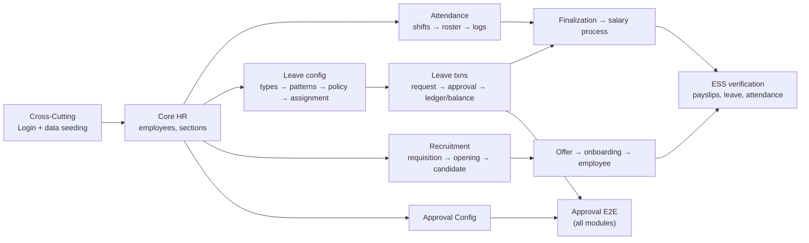

# HRMS — Work Breakdown Structure (WBS) & Effort Estimate

> **Project:** Progbiz ERP · **Module:** HRMS · **App:** https://hrms-erp.progbiz.in (tenant `Hrms`)
> **Tracker:** [`docs/excel/WBS_HRMS.xlsx`](../../docs/excel/WBS_HRMS.xlsx) — the live file for daily actuals
> **Generator:** [`scripts/gen_wbs_hrms_xlsx.py`](../../scripts/gen_wbs_hrms_xlsx.py) · **Coverage check:** [`scripts/check_wbs_hrms_coverage.py`](../../scripts/check_wbs_hrms_coverage.py)
> **Basis:** the live study in [`hrms/docs/`](.) (all 80 pages crawled) plus the actual Playwright automation of those pages

---

## 1. Summary

| Sub-Module | Pages | Checks | Estimated Hours | Share |
|---|---:|---:|---:|---:|
| Core HR | 18 | 18 | **46.5** | 21% |
| Recruitment & Onboarding | 15 | 15 | **38.5** | 18% |
| Attendance & Time | 15 | 13 | **39.5** | 18% |
| Leave Management | 21 | 21 | **52.0** | 24% |
| My Workspace (ESS) | 11 | 11 | **26.5** | 12% |
| Cross-Cutting | — | 5 | **14.0** | 6% |
| **TOTAL** | **80** | **83** | **217.0 h** | 100% |

At ~7 productive hours/day that is **≈ 31 working days (~6 working weeks)** for one QA engineer, excluding defect-fix retest cycles beyond the 2.5 h already budgeted.

> Coverage is machine-verified: `check_wbs_hrms_coverage.py` confirms all **80/80** crawled routes appear in the WBS (0 missing).

## 2. How this estimate was built

Estimates are **not** uniform per page. Each row is priced from what the page actually does, using evidence gathered while automating it:

| Effort driver | Where it appears | Effect |
|---|---|---|
| Filter-first report pages (grid empty until queried) | attendance-log, approval-*, leave-ledger, `*-report` | +time for filter matrix before any assertion |
| Filters hidden in a slide-out offcanvas panel | shift-roster, overtime-approval, timesheet, leave-ledger, leave-attendance-sync | +time; controls invisible until the panel is opened |
| SweetAlert2 confirm/validation dialogs | employee-deduction and other entry forms | +time; dialogs block interaction until dismissed |
| Routed create pages (not modals) | `/candidate/0`, holiday `/holiday-calendar` | +time; navigation + back-out paths |
| Non-grid visualisations | recruitment-pipeline (kanban), leave-calendar, worker-directory (org chart), ess/locations (Google Maps) | Highest per-page cost |
| State-mutating gates | attendance-finalization, leave-attendance-sync recalculation | +time; must be exercised carefully, read-only paths first |
| Data-dependent empty states | absence-analytics, comp-off-management, onboarding-* | +time; two behaviours to verify per page |
| Config chains (must be seeded in order) | leave types→pattern→policy→assignment; shifts→roster; requisition→opening→candidate | Pulled into the Cross-Cutting seeding row |

**Assumptions**
1. One QA engineer, functional/manual test design + execution on the `Hrms` tenant.
2. The Cross-Cutting *Test data seeding* row (3.0 h) is done **first** — most state-dependent checks depend on it.
3. Estimates cover first-pass execution + logging; 2.5 h is budgeted for retesting known build bugs, not for an open-ended fix cycle.
4. Automation build effort is **not** in these numbers (that work is already delivered under `hrms/tests`).

## 3. WBS — Core HR (18 pages · 46.5 h)

| # | Page / Functionality Check | Scope | Est h |
|---|---|---|---:|
| 1 | Employee listing (`/employees`) | List load, Filter panel, incl-archived, columns, row actions, drill-down | 3.0 |
| 2 | Employee create / edit form | Full field matrix, mandatory negatives, save/cancel | 4.0 |
| 3 | Sections (`/sections`) | Department-linked CRUD, duplicate rejection | 1.5 |
| 4 | Worker Directory (`/worker-directory`) | Cards view, Org Chart view, filters, search | 2.5 |
| 5 | Salary Revisions (`/salary-revisions`) | Raise Revision, history, %-change, approval status | 3.0 |
| 6 | Employee Salary Process (`/employee-salary-process`) | Branch, staff, Basic/leave/payable computation, narration | 3.5 |
| 7 | Employee Deductions (`/employee-deduction`) | Entry form, typeahead, save, Cancel discards | 2.5 |
| 8 | Employee Remarks (`/employee-remark`) | Reduced form; header build bug | 1.5 |
| 9 | Probation Dashboard (`/hrms/probation`) | Start Probation, reviews, days-left, decisions | 3.0 |
| 10 | Probation Templates (`/hrms/probation-templates`) | Duration, checkpoints, criteria, default/active | 2.0 |
| 11 | Probation Report (`/hrms/probation-report`) | Date range, outcome filter, Run Report, Export | 2.0 |
| 12 | Resigned Employees (`/resigned-employees`) | List + name filter | 1.0 |
| 13 | Employee Excel Import (`/upload-employee`) | Sample download, Excel Rules, valid + malformed upload | 3.0 |
| 14 | Letter Templates (`/letters/templates`) | CRUD + merge fields | 2.5 |
| 15 | Generate Letter (`/letters/generate`) | Preview, Generate, send mail → ESS letters | 3.0 |
| 16 | My Approvals (`/approvals`) | 3 tabs, counts, approve/reject | 3.0 |
| 17 | Approval Config (`/approval/config`) | Chain builder, + Add level, Save Workflow | 3.5 |
| 18 | Deduction & Remark Reports | 2 filter-first report pages | 2.0 |

## 4. WBS — Recruitment & Onboarding (15 pages · 38.5 h)

| # | Page / Functionality Check | Scope | Est h |
|---|---|---|---:|
| 1 | Job Requisitions (`/requisition-list`) | New Requisition, status, search | 2.5 |
| 2 | Job Board / Hiring (`/vacancy-list`) | Add Job Opening, status filter, counters, tab strip | 3.0 |
| 3 | Public careers (`/current-openings`) | Listing, selector, apply, unauthenticated access | 2.0 |
| 4 | Job Applications (`/job-applications-list`) | Grid, details, Schedule Interview, Reject | 2.5 |
| 5 | Candidates (`/candidates`) | 5 status buckets + counts, search, filters | 3.0 |
| 6 | Candidate create form (`/candidate/0`) | Routed form, country code, skills, résumé upload | 3.5 |
| 7 | Assessments (`/assessment-list`) | CRUD + attachment, max score | 2.0 |
| 8 | Interview Schedules (`/interview-schedules`) | Schedule, round, mode, reschedule, cancel | 2.5 |
| 9 | Offers (`/offer-list`) | New Offer, CTC, joining, lifecycle | 2.5 |
| 10 | Recruitment Pipeline (`/recruitment-pipeline`) | Kanban, mandatory vacancy filter, Configure Stages, drag | 4.5 |
| 11 | Communication Templates (`/communication-templates`) | CRUD master | 2.0 |
| 12 | Talent Pool (`/talent-pool`) | Search, skill/pool filters, tags, score | 2.0 |
| 13 | Recruitment settings | `/candidate-status` + `/interview-rounds` | 2.0 |
| 14 | Onboarding Templates (`/onboarding-templates`) | Checklist template CRUD | 2.0 |
| 15 | Onboarding Pipeline (`/onboarding-pipeline`) | Start Onboarding → employee record | 2.5 |

## 5. WBS — Attendance & Time (15 pages · 39.5 h)

| # | Page / Functionality Check | Scope | Est h |
|---|---|---|---:|
| 1 | Shifts & Rules (`/shifts`) | New Shift, timing, night flag, active | 3.0 |
| 2 | Shift Roster (`/shift-roster`) | Scope cascade ×4, date range, assignments | 3.5 |
| 3 | Attendance Log (`/attendance-log`) | Filter-first, 15 columns, session details | 3.0 |
| 4 | Data from Device (`/data-from-device`) | Biometric feed, recognition type, device, image | 2.5 |
| 5 | Add Visit Report (`/add-visit-report`) | Field visits, site image, mobile location | 2.5 |
| 6 | Regularization (`/regularization`) | Raise correction + attachment, approve/reject | 3.5 |
| 7 | Overtime Approval (`/overtime-approval`) | OT minutes, eligibility, payout, exported | 3.0 |
| 8 | Attendance Finalization (`/attendance-finalization`) | Pay-cycle run, cut-off, pending, Finalize | 4.0 |
| 9 | Geofences (`/geofences`) | Add Location, scope, radius, activate | 3.0 |
| 10 | Timesheet (`/timesheet`) | Attendance hrs vs task hrs | 2.5 |
| 11 | Attendance Report Pack (`/attendance-report-pack`) | Daily register, filters, Export, paging | 3.0 |
| 12 | Operation approval (+report) | `/approval-operation` ×2 pages | 3.0 |
| 13 | Absent approval (+report) | `/approval-absent` ×2 pages | 3.0 |

## 6. WBS — Leave Management (21 pages · 52.0 h)

| # | Page / Functionality Check | Scope | Est h |
|---|---|---|---:|
| 1 | Leave Types (`/leave-types`) | Half-day + document flags, CRUD | 2.0 |
| 2 | Leave Patterns (`/leave-patterns`) | Entitlement details per type | 2.0 |
| 3 | Leave Policy (`/leave-policy`) | Pattern chooser, policy config | 2.0 |
| 4 | Leave Assignment (`/leave-assignment-list`) | Branch/dept/employee assignment matrix | 2.5 |
| 5 | Leave Request (`/leave-request-list`) | New request, status, edit/cancel rules | 2.5 |
| 6 | Leave Approval (`/leave-approval`) | Bulk approve/reject, filters, Delegate modal | 4.0 |
| 7 | My Leave Policy (`/my-leave-policy`) | Year, Show, entitlement display | 1.5 |
| 8 | Leave Balances (`/leave-balances`) | Run Accrual, 10-column arithmetic, liability | 3.5 |
| 9 | Leave Ledger (`/leave-ledger`) | Append-only txns, balance-after, Export | 3.0 |
| 10 | Leave ↔ Attendance Sync (`/leave-attendance-sync`) | LOP flags, sync status, Recalculate period | 3.0 |
| 11 | Leave Encashment (`/leave-encashment`) | Request, days, amount, status | 2.0 |
| 12 | Encashment Approval (`/leave-encashment-approval`) | 5 filters, approve/reject, amounts | 2.5 |
| 13 | Leave Delegation (`/leave-delegation`) | Active & past delegation registry | 2.0 |
| 14 | Employee Handover (`/employee-handover`) | From/to, dates, covers, active | 2.5 |
| 15 | Comp-Offs (`/comp-offs`) | Request, earned/source/expiry | 2.0 |
| 16 | Comp-Off Management (`/comp-off-management`) | Grant/Reject per row, pending-only | 2.5 |
| 17 | Holidays (`/holiday-list`) | CRUD, search, Export, `/holiday-calendar` view | 2.5 |
| 18 | Holiday Assignment (`/holiday-assignment-list`) | Assignment matrix | 2.0 |
| 19 | Leave Reports (`/leave-reports`) | Register / Balance / Utilization modes | 3.0 |
| 20 | Absence Analytics (`/absence-analytics`) | Trend, dept rate, Bradford Factor table | 3.0 |
| 21 | Leave Calendar (`/leave-calendar`) | Month view, filters, leave markers | 2.0 |

## 7. WBS — My Workspace / ESS (11 pages · 26.5 h)

| # | Page / Functionality Check | Scope | Est h |
|---|---|---|---:|
| 1 | ESS Dashboard (`/ess`) | 4 KPI tiles, Quick Actions, holidays, birthdays | 2.5 |
| 2 | My Profile (`/ess/profile`) | Overview + Request A Change → approval | 3.0 |
| 3 | My Requests (`/ess/requests`) | Change-request status, empty state | 1.5 |
| 4 | My Leave (`/ess/leave`) | Balances + Apply For Leave + my requests | 3.0 |
| 5 | My Handover (`/my-handover`) | Assignee, dates, covers, Save/Clear | 2.0 |
| 6 | My Attendance (`/ess/attendance`) | History, Regularize, Raise OT | 3.0 |
| 7 | My Locations (`/ess/locations`) | Google Maps, read-only lat/long, Submit for approval | 3.5 |
| 8 | My Documents (`/ess/documents`) | Upload with type/number/category/expiry | 2.5 |
| 9 | My Letters (`/ess/letters`) | Request + acknowledge, KPI decrement | 2.0 |
| 10 | My Pay (`/ess/payslips`) | Year Show, salary columns, PDF footnote | 2.0 |
| 11 | My Probation (`/ess/probation`) | Status panel, not-on-probation state | 1.5 |

## 8. WBS — Cross-Cutting (14.0 h)

| # | Item | Scope | Est h |
|---|---|---|---:|
| 1 | Login & session | 3-field tenant login, negatives, expiry redirect | 2.0 |
| 2 | Navigation & menu integrity | All 80 routes reachable, breadcrumbs | 2.5 |
| 3 | Approval workflow E2E | Chain config → leave / salary / regularization / encashment / profile-change | 4.0 |
| 4 | Test data seeding & environment | Employees, shifts+roster, leave chain, holidays, hiring funnel | 3.0 |
| 5 | Defect logging & retest | Log + retest known build bugs | 2.5 |

## 9. Critical path & sequencing

Run in this order — later items are blocked without the earlier config:

## 10. Risks affecting the estimate

| Risk | Impact | Mitigation built into the plan |
|---|---|---|
| Tenant data volatility (analytics/probation data disappearing) | Checks pass/fail by data state, not code | Empty states treated as valid documented outcomes |
| State-mutating gates (Finalization, Recalculate period) | Cannot be freely exercised on a shared tenant | Read-only paths first; mutation only on a disposable period |
| External Google Maps dependency (`/ess/locations`) | Map + the grid below it may not render | Page-level wait/scroll; assertions tolerate a non-rendering map |
| Known build bugs (remark header, "Add Vist Report", stray card title) | Ambiguity over expected text | Logged as defects; asserted as-is until fixed |
| Config-chain coupling | A missing master blocks a whole sub-module | Seeding is an explicit, sequenced first task |

## 11. Daily tracking routine (per the agreed practice)

1. Log a row per sub-module worked in **Daily Hours Log** (Date, Module, Sub-Module, Hours, What was done).
2. Update **Actual Hours**, **Date Worked**, **Status** on the matching WBS Tracker row (hours cumulative).
3. **Variance** auto-calculates (Estimated − Actual); raise negative variance early rather than at the end.
4. The **Dashboard** sheet rolls up per sub-module (checks, completed, %, est vs actual) and today's/total logged hours.
5. Regenerate the workbook after scope changes: `python scripts/gen_wbs_hrms_xlsx.py`, then re-verify coverage with `python scripts/check_wbs_hrms_coverage.py`.
